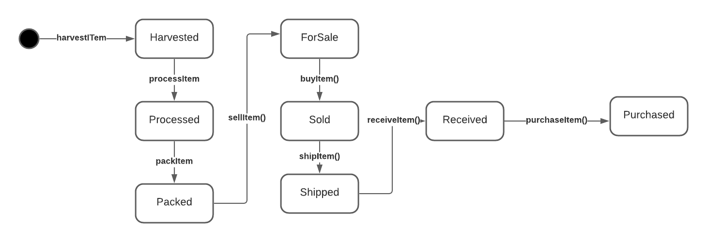

# Supply chain & data auditing

This repository containts an Ethereum DApp that demonstrates a Supply Chain flow between a Seller and Buyer. The user story is similar to any commonly used supply chain process. A Seller can add items to the inventory system stored in the blockchain. A Buyer can purchase such items from the inventory system. Additionally a Seller can mark an item as Shipped, and similarly a Buyer can mark an item as Received.

The DApp User Interface when running should look like...


## Design

### Activity Diagram


### Sequence Diagram


### State Diagram 



### Class Diagram


## Contract Addresses

### FarmerRole address
https://rinkeby.etherscan.io/address/0x51BE0BBFc2f52172Fbf7CE9E4da67aC663de54a3

   Deploying 'FarmerRole'
   ----------------------
   > transaction hash:    0xc2d7efd186576150f9677fd6043f83678b3e554b6581553a8e5cc1a26de35a60
   > Blocks: 1            Seconds: 12
   > contract address:    0x51BE0BBFc2f52172Fbf7CE9E4da67aC663de54a3
   > block number:        9523337
   > block timestamp:     1635110062
   > account:             0x77D2afC664328661cf3d04525e902dAE0D9C7Fd6

### DistributorRole address
https://rinkeby.etherscan.io/address/0x78D2b96307fE9FE94a6bA7675aC63Da6D787Ea59

Deploying 'DistributorRole'
   ---------------------------
   > transaction hash:    0xc4f61078c418f9f84416e6c0d9f33ba489300c0ad7434865f673f272bb2cbcfc
   > Blocks: 1            Seconds: 12
   > contract address:    0x78D2b96307fE9FE94a6bA7675aC63Da6D787Ea59
   > block number:        9523338
   > block timestamp:     1635110077
   > account:             0x77D2afC664328661cf3d04525e902dAE0D9C7Fd6

### RetailerRole address
https://rinkeby.etherscan.io/address/0x4999ad2E23658923ba1805a70A9328B13EEdd023

 Deploying 'RetailerRole'
   ------------------------
   > transaction hash:    0xf017c014d5b7b4f6e02be30281f5c0ccdd26111eeb7a11d1dfa68957423471ec
   > Blocks: 1            Seconds: 12
   > contract address:    0x4999ad2E23658923ba1805a70A9328B13EEdd023
   > block number:        9523339
   > block timestamp:     1635110092
   > account:             0x77D2afC664328661cf3d04525e902dAE0D9C7Fd6

### ConsumerRole address
https://rinkeby.etherscan.io/address/0x97A8E9EdD55D30C7e4189eff755e8f6973aB543D

Deploying 'ConsumerRole'
   ------------------------
   > transaction hash:    0x8f5cd62154193a95f35333dfd189ef0b0a77875b387d72fd76f6e837679c7ba8
   > Blocks: 1            Seconds: 12
   > contract address:    0x97A8E9EdD55D30C7e4189eff755e8f6973aB543D
   > block number:        9523340
   > block timestamp:     1635110107
   > account:             0x77D2afC664328661cf3d04525e902dAE0D9C7Fd6

### SupplyChain address
https://rinkeby.etherscan.io/address/0x64FF3F6B2456eb753F8df7db54d16bA9d3a9F27b

Deploying 'SupplyChain'
   -----------------------
   > transaction hash:    0xca5a5856654a50960725a4578607ab2fcb7633396e4de3b8cf0cfc0a33d90697
   > Blocks: 1            Seconds: 12
   > contract address:    0x64FF3F6B2456eb753F8df7db54d16bA9d3a9F27b
   > block number:        9523341
   > block timestamp:     1635110122
   > account:             0x77D2afC664328661cf3d04525e902dAE0D9C7Fd6


## Getting Started

These instructions will get you a copy of the project up and running on your local machine for development and testing purposes. See deployment for notes on how to deploy the project on a live system.

### Prerequisites

Please make sure you've already installed ganache-cli, Truffle and enabled MetaMask extension in your browser.

```
Give examples (to be clarified)
```

### Installing

> The starter code is written for **Solidity v0.4.24**. At the time of writing, the current Truffle v5 comes with Solidity v0.5 that requires function *mutability* and *visibility* to be specified (please refer to Solidity [documentation](https://docs.soliditylang.org/en/v0.5.0/050-breaking-changes.html) for more details). To use this starter code, please run `npm i -g truffle@4.1.14` to install Truffle v4 with Solidity v0.4.24. 

A step by step series of examples that tell you have to get a development env running

Clone this repository:

```
git clone https://github.com/udacity/nd1309/tree/master/course-5/project-6
```

Change directory to ```project-6``` folder and install all requisite npm packages (as listed in ```package.json```):

```
cd project-6
npm install
```

Launch Ganache:

```
ganache-cli -m "spirit supply whale amount human item harsh scare congress discover talent hamster"
```

Your terminal should look something like this:


In a separate terminal window, Compile smart contracts:

```
truffle compile
```

Your terminal should look something like this:


This will create the smart contract artifacts in folder ```build\contracts```.

Migrate smart contracts to the locally running blockchain, ganache-cli:

```
truffle migrate
```

Your terminal should look something like this:


Test smart contracts:

```
truffle test
```

All 10 tests should pass.


In a separate terminal window, launch the DApp:

```
npm run dev
```

## Built With

* [Ethereum](https://www.ethereum.org/) - Ethereum is a decentralized platform that runs smart contracts
* [IPFS](https://ipfs.io/) - IPFS is the Distributed Web | A peer-to-peer hypermedia protocol
to make the web faster, safer, and more open.
* [Truffle Framework](http://truffleframework.com/) - Truffle is the most popular development framework for Ethereum with a mission to make your life a whole lot easier.


## Authors

See also the list of [contributors](https://github.com/your/project/contributors.md) who participated in this project.

## Acknowledgments

* Solidity
* Ganache-cli
* Truffle
* IPFS
